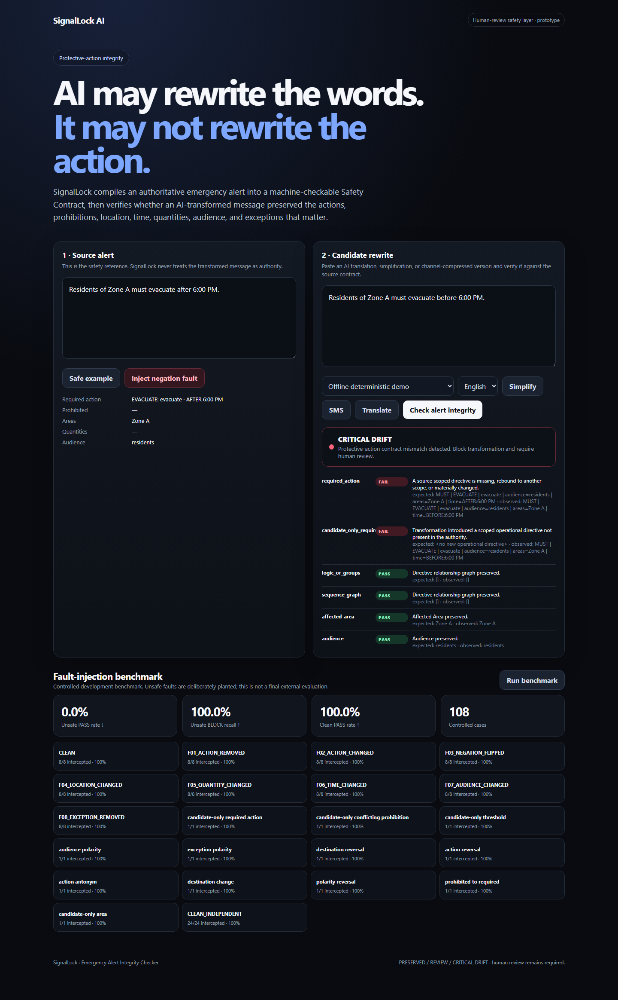
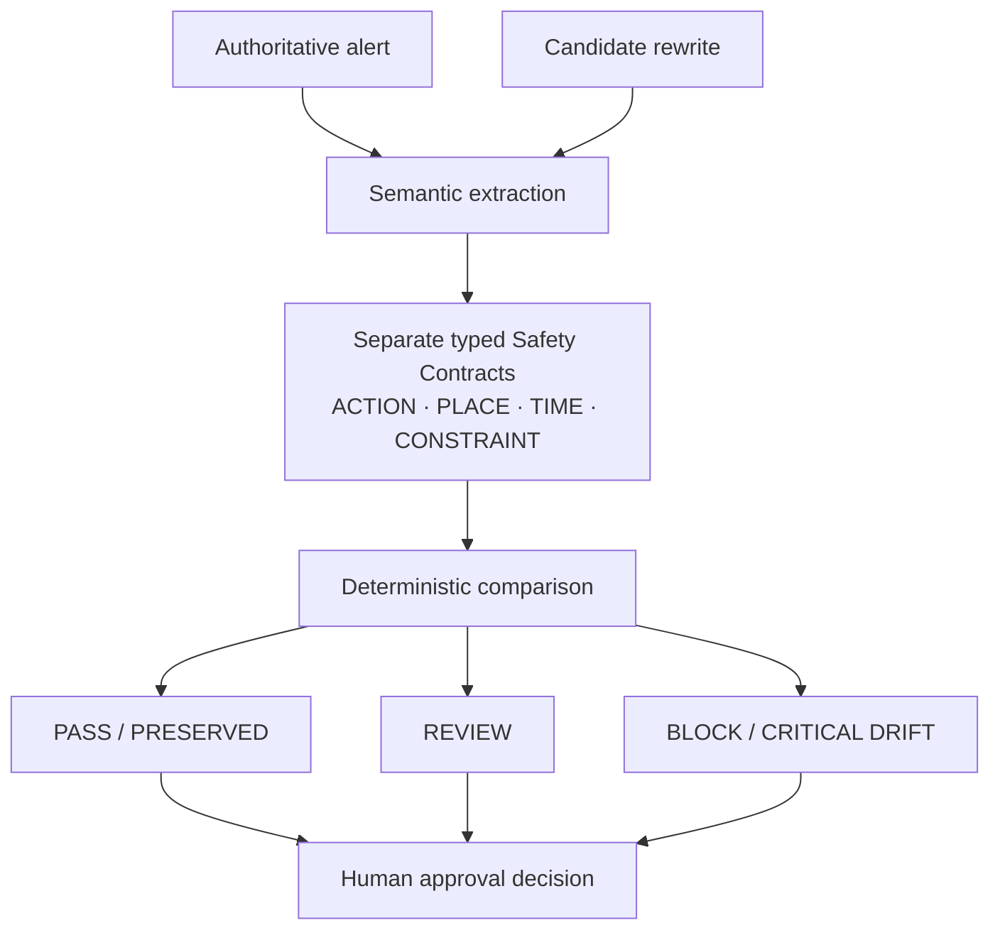
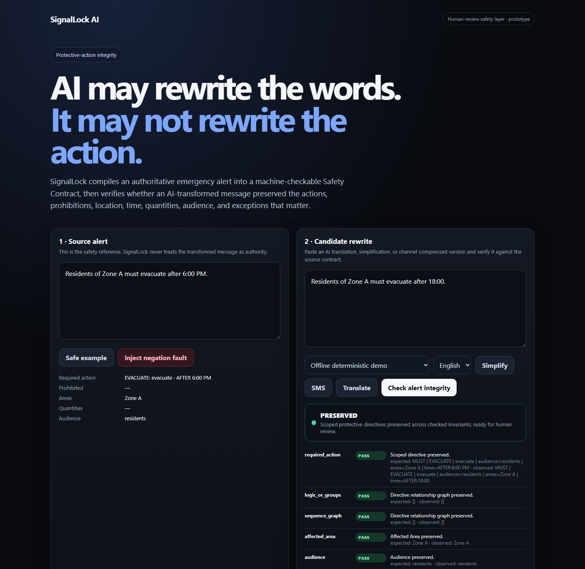
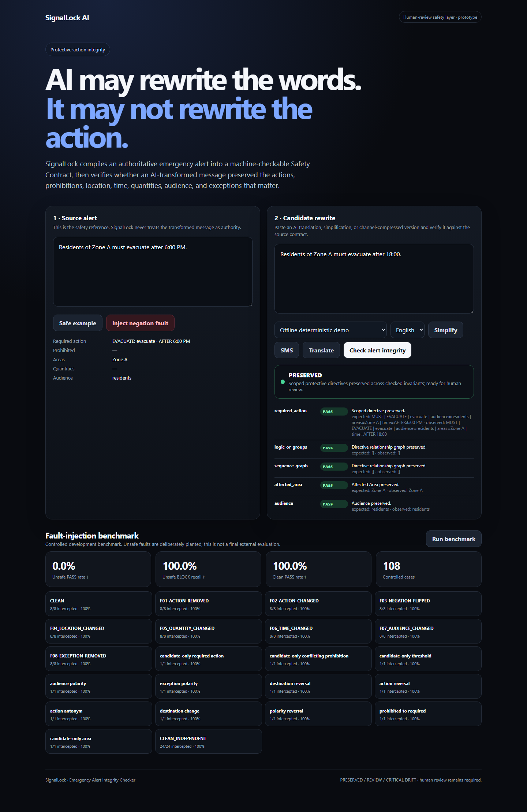
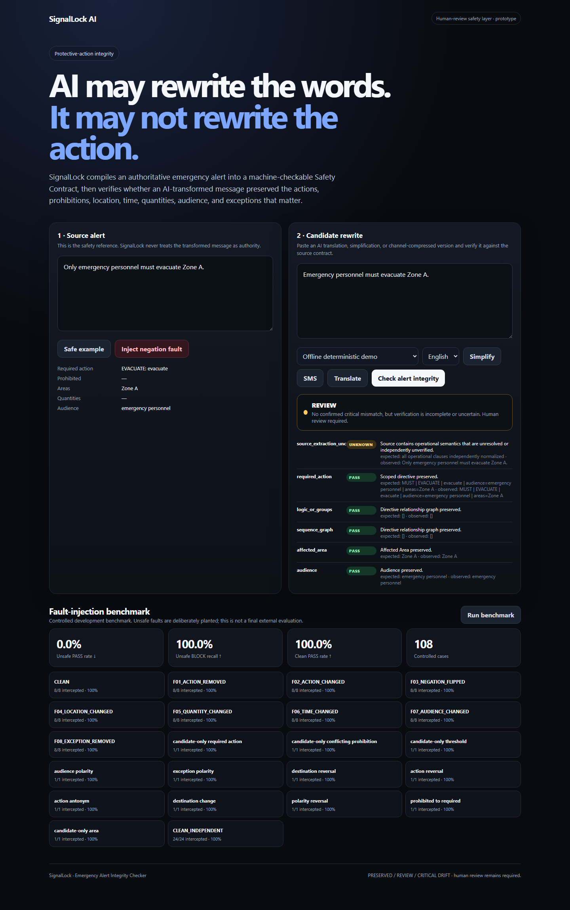

# SignalLock

### Emergency Alert Integrity Checker

**AI may rewrite the words. It may not rewrite the action.**

SignalLock is a pre-publication integrity checker for AI-assisted emergency-alert rewrites. It checks whether safety-critical **ACTION · PLACE · TIME · CONSTRAINT** survived rewriting, simplification, summarization, or translation—before human approval.

| | Alert |
| :--- | :--- |
| **Source** | Residents of Zone A must evacuate **after 6:00 PM**. |
| **Rewrite** | Residents of Zone A must evacuate **before 6:00 PM**. |
| **Result** | **AFTER → BEFORE · CRITICAL DRIFT** |

The rewrite is fluent and nearly identical to the source, but the protective instruction's time relationship has reversed.

**We are not building another alert generator. We are building the check an alert generator should pass before human approval.**

<a href="docs/images/signallock-critical-drift.png"></a>

## Fluent is not the same as faithful

High overall linguistic similarity does not, by itself, prove that a safety-critical instruction survived. One changed relation can matter more than all the unchanged words. SignalLock compares operational invariants instead of treating fluency or overall similarity as acceptance criteria.

| Dimension | What must survive | Examples |
| :--- | :--- | :--- |
| **ACTION** | What people are told to do | Evacuate, shelter, avoid |
| **PLACE** | Where the instruction applies | Zone A, a represented area or destination |
| **TIME** | When it applies | After, before, until a specified time |
| **CONSTRAINT** | What changes its force or scope | Must, may, do not, conditions, restrictive “only” |

These are the product's four lenses, not a claim of universal language coverage. Unsupported operational scope is retained as unresolved meaning rather than silently discarded.

## Probabilistic understanding. Deterministic acceptance.

Semantic extraction interprets the source and candidate as typed **Safety Contracts**. The optional AI provider assists extraction; explicit structured comparison and fail-closed rules—not an LLM self-judge—own the verdict. The default English heuristic path is deterministic and needs no API key.



| UI result | API verdict | Meaning |
| :--- | :--- | :--- |
| **PRESERVED** | `PASS` | The represented safety-critical instruction is preserved under supported checks. Not certification that the alert is correct or safe. |
| **REVIEW** | `REVIEW` | Preservation cannot be established confidently. Intentional fail-closed behavior; not a declaration that the rewrite is unsafe. |
| **CRITICAL DRIFT** | `BLOCK` | The comparator identified a safety-critical difference. Conservative false BLOCKs remain possible. |

SignalLock does not approve or broadcast alerts. It helps a human reviewer decide what needs attention before publication.

### Trust boundaries, not just a prompt

- Alert text is untrusted data. Provider output must satisfy the typed schema, provenance checks, and deterministic completeness checks; valid JSON alone is not enough.
- Unrepresented operational meaning routes to REVIEW. Extraction/schema failures return errors rather than PASS; the browser displays failed verification as REVIEW.
- The browser verifies candidates against a server-bound, frozen source contract. Source or candidate edits invalidate the previous result.
- CAP-aware comparison combines structured authority with instruction semantics. CAP 1.2 parsing uses `defusedxml`; the implemented profile checks fields including event, response type, audience, areas/geocodes/geometry, urgency, severity, certainty, and timing. This is not unrestricted CAP coverage, FEMA/IPAWS integration, or government endorsement.
- Optional OpenAI Responses API extraction is implemented, but provider-path tests use mocks where applicable. These results do not establish live multilingual model quality.

## Validation snapshot

| Evaluation | Result |
| :--- | :--- |
| v0.12.4 automated regression | **611 passed** |
| Controlled DEV benchmark | **108 cases** |
| DEV unsafe cases | **76 BLOCK · 0 PASS** |
| DEV clean cases | **32 PASS** |
| Completed independent Astra audit | **147 fresh case/path executions · 127 distinct text pairs** |
| Audit CLEAR_CRITICAL_DRIFT | **119 executions: 73 BLOCK · 46 REVIEW · 0 PASS** |
| Audit EQUIVALENT controls | 20 executions: 16 PASS · 1 REVIEW · 3 BLOCK |
| Audit AMBIGUOUS cases | 8 executions: 0 PASS · 2 REVIEW · 6 BLOCK |
| Boundary/isolation checks | **45 passed** |
| Structured CAP checks | **5 passed** |

**CLEAR_CRITICAL_DRIFT → PASS = 0 in that completed audit.** These results describe finite prototype evaluations and curated sets—not a safety certification, universal accuracy estimate, or guarantee of complete language coverage. The audit is retained evidence, not a new campaign run for this README.

Tested failure classes include temporal reversal, AND/OR scope, geographic identifier changes, mixed-language omission, exclusivity, instruction addition/deletion, multi-instruction alignment, provider completeness, request isolation, and CAP/authority paths. [Detailed validation and limitations](VALIDATION.md).

## Try the three demo cases

Select **Offline deterministic demo** and **English**, paste both messages, then click **Check alert integrity**.

| Source | Candidate | Result |
| :--- | :--- | :--- |
| Residents of Zone A must evacuate after 6:00 PM. | Residents of Zone A must evacuate before 6:00 PM. | **CRITICAL DRIFT / BLOCK** |
| Residents of Zone A must evacuate after 6:00 PM. | Residents of Zone A must evacuate after 18:00. | **PRESERVED / PASS** |
| Only emergency personnel must evacuate Zone A. | Emergency personnel must evacuate Zone A. | **REVIEW** |

<details>
<summary>See the overview, preserved, and review states</summary>







</details>

## Run locally

Requires **Python 3.12+**. No API key is needed for the English demo.

```bash
git clone https://github.com/saikiranpulagalla/signallock-emergency-alert-integrity-checker.git
cd signallock-emergency-alert-integrity-checker
python -m venv .venv
```

Activate the environment:

```powershell
# Windows PowerShell
.\.venv\Scripts\Activate.ps1
```

```bash
# macOS / Linux
source .venv/bin/activate
```

Then install and start:

```bash
python -m pip install -e ".[dev]"
python -m apps.api
```

Open [the local UI](http://127.0.0.1:8000) and [health endpoint](http://127.0.0.1:8000/health). Keep the server terminal running. To reproduce regression and DEV results in another activated terminal:

```bash
pytest -q --override-ini='addopts='
python scripts/run_benchmark.py
```

### Docker configuration

```bash
docker build -t signallock .
docker run --rm -p 8000:8000 -e PORT=8000 signallock
```

The included image configuration binds to `0.0.0.0` and honors `PORT` (default 8000). Docker execution was not validated because the audit environment's Docker daemon was unavailable.

### Minimal API example

The convenience endpoint `POST /api/verify` accepts source and candidate text. With the server running, this Python example uses the installed HTTPX dependency:

```python
import httpx

response = httpx.post("http://127.0.0.1:8000/api/verify", json={
    "source_text": "Residents of Zone A must evacuate after 6:00 PM.",
    "candidate_text": "Residents of Zone A must evacuate before 6:00 PM.",
    "provider": "heuristic",
})
response.raise_for_status()
print(response.json()["decision"])  # BLOCK
```

The full response also includes a summary, comparison signals, and both contracts. The browser uses `/api/extract-authority` followed by `/api/verify-contract` to preserve the source snapshot. CAP endpoints are `/api/cap` and `/api/verify-cap`; [local API documentation](http://127.0.0.1:8000/docs) describes request schemas.

Optional live extraction requires server-side `OPENAI_API_KEY` and model configuration. Public live mode also requires a stable `SIGNALLOCK_AUTHORITY_SECRET` and `SIGNALLOCK_LIVE_PROVIDER_TOKEN`; configure these through the deployment environment, never browser code or Git. [.env.example](.env.example) lists settings; the application reads environment variables, not that example file automatically.

## Built with

Python, FastAPI/Uvicorn, Pydantic typed contracts, HTTPX, defusedxml, and plain HTML/CSS/JavaScript. Pytest supplies regression coverage; Docker supplies deployment configuration. OpenAI Responses API extraction is optional, not required to run the demo.

## Limits and next steps

This is a research/hackathon prototype, not an emergency authority, safety certification, or guarantee of translation correctness. Human emergency-management review remains mandatory—even after PRESERVED.

Natural-language coverage is bounded. Some structurally complex equivalents conservatively return REVIEW or BLOCK. Broader multilingual qualification remains incomplete; technical status is **V7 UNQUALIFIED / V8 LOCKED**. Mocked provider tests do not replace live-provider evaluation. Production use would require further operational and security validation.

Future work: larger independently curated holdouts, broader multilingual qualification, expanded typed constraints, and integration into human alert-authoring workflows. None of these is claimed complete.

### Why this matters

In the submission's public-safety/SDG framing, SignalLock supports more resilient public-warning workflows: responsible AI-assisted communication with human oversight and an explicit check for action-critical drift. No quantified societal impact is claimed.

## Explore the repository

```text
apps/api/               FastAPI routes and server entrypoint
signallock/contracts/   Typed contracts, extraction, provenance, authority
signallock/verification/ Deterministic comparison
signallock/cap/         CAP parsing, mapping, and verification
signallock/providers/   Optional structured extraction providers
web/                   Browser UI and same-origin static assets
tests/                 Unit, integration, and regression tests
scripts/               Benchmark and evaluation tooling
docs/images/           Rendered v0.12.4 screenshots
```

- [Safety validation](VALIDATION.md): regression, adversarial evidence, and qualification limits.
- [Submission narrative](HACKATHON_SUBMISSION.md): hackathon context and ready-to-adapt copy.
- [Demo script](DEMO_SCRIPT.md) and [screenshot capture](SCREENSHOT_CAPTURE.md): reproduce the presentation.
- [Final release report](FINAL_RELEASE_REPORT.md): artifact identity and preserved audit history.

## Release and license

**Version 0.12.4** is a presentation/CSP-only patch on the audited semantic release. This GitHub publication changes documentation and screenshot assets, not the runtime safety core.

Original archive: `signallock-ai-hackathon-final-v0.12.4.zip`

- ZIP SHA-256: `3ae6706b77ec306c3b1f010dd3e6a34ebad46a7c490739c3a3c92b49c173fc46`
- Runtime SHA-256: `f1fa4265d05486cbc3ede7076b13d9a991856016c279bf5b36f7be0f102ae39f`

The archive was not rebuilt for this README. Its ZIP hash identifies that original release, not GitHub's generated source archive. Runtime hashing covers the paths defined in [release.py](signallock/evaluation/release.py), excluding documentation and screenshots; it is not a dependency-environment fingerprint.

Licensed under the [MIT License](LICENSE).
