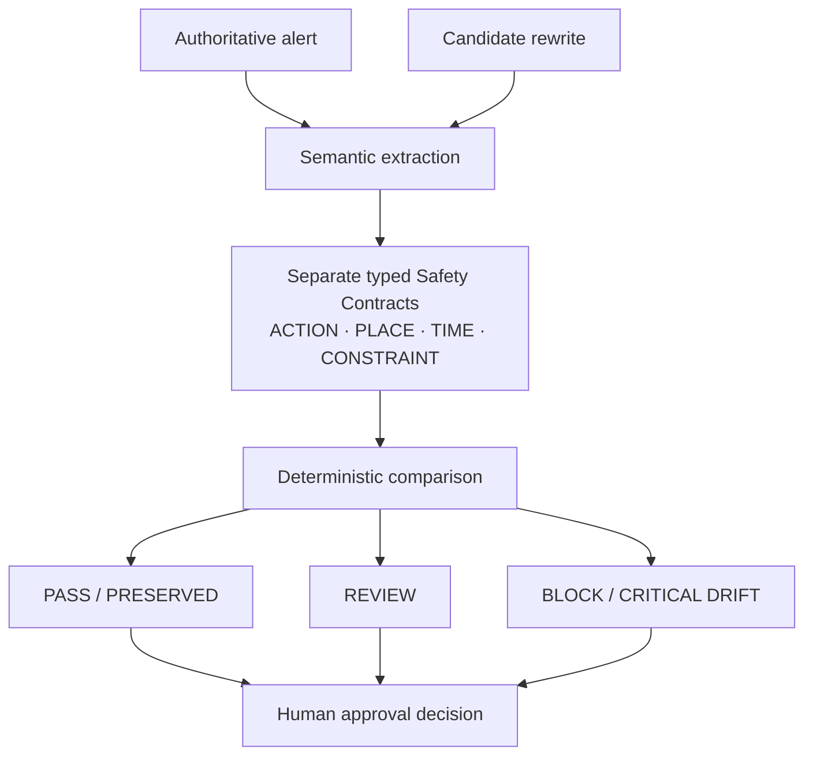

# SignalLock

### Emergency Alert Integrity Checker

**AI may rewrite the words. It may not rewrite the action.**

SignalLock is a pre-publication integrity checker for AI-assisted emergency-alert rewrites. It checks whether safety-critical **ACTION · PLACE · TIME · CONSTRAINT** survived rewriting, simplification, summarization, or translation—before human approval.

| | Alert |
| :--- | :--- |
| **Source** | Residents of Zone A must evacuate **after 6:00 PM**. |
| **Rewrite** | Residents of Zone A must evacuate **before 6:00 PM**. |
| **Result** | **AFTER → BEFORE · CRITICAL DRIFT** |

The rewrite is fluent and nearly identical to the source, but the protective instruction's time relationship has reversed.

**We are not building another alert generator. We are building the check an alert generator should pass before human approval.**

<a href="docs/images/signallock-critical-drift.png"></a>

## Fluent is not the same as faithful

High linguistic similarity does not by itself prove that a safety-critical instruction survived. SignalLock compares the operational meaning:

| Dimension | What must survive | Examples |
| :--- | :--- | :--- |
| **ACTION** | What people are told to do | Evacuate, shelter, avoid |
| **PLACE** | Where the instruction applies | Zone A, a represented area or destination |
| **TIME** | When it applies | After, before, until a specified time |
| **CONSTRAINT** | What changes its force or scope | Must, may, do not, conditions, restrictive “only” |

## Probabilistic understanding. Deterministic acceptance.

Source and candidate become typed **Safety Contracts**. Extraction may use an AI provider, but explicit comparisons and fail-closed rules determine the verdict. The default English heuristic path is deterministic.



| UI result | API verdict | Meaning |
| :--- | :--- | :--- |
| **PRESERVED** | `PASS` | Represented safety-critical meaning is preserved under supported checks. |
| **REVIEW** | `REVIEW` | Preservation is uncertain. Human review is required; this does not mean the rewrite is definitely unsafe. |
| **CRITICAL DRIFT** | `BLOCK` | The comparator identified a safety-critical difference. |

SignalLock does not approve or broadcast alerts. It helps a human reviewer decide what needs attention before publication.

## Validation snapshot

| Evaluation | Result |
| :--- | :--- |
| v0.12.4 automated regression | **611 passed** |
| Controlled DEV benchmark | **108 cases: 76 unsafe BLOCK · 0 unsafe PASS · 32 clean PASS** |
| Final critical red-team executions | **119 total: 73 BLOCK · 46 REVIEW · 0 PASS** |
| Boundary/isolation checks | **45 passed** |
| Structured CAP checks | **5 passed** |

**0 of 119 CLEAR_CRITICAL_DRIFT executions in the final red-team audit received PASS.** The full audit covered 147 case/path executions and 127 distinct text pairs.

These results describe the tested prototype and its defined evaluation sets; they are not a safety certification or guarantee of complete language coverage. [Full results, including equivalent and ambiguous controls](VALIDATION.md).

Tested classes include temporal reversal, AND/OR scope, geographic changes, instruction addition/deletion, exclusivity, mixed-language omissions, multi-instruction alignment, and provider completeness.

### Trust boundaries

- Alert text is untrusted data. Provider output faces schema, provenance, and completeness checks.
- Unrepresented operational meaning produces REVIEW; extraction failures never become PASS.
- The browser compares against a server-bound source contract and invalidates results when inputs change.
- CAP 1.2 comparison combines structured fields—such as area, urgency, and timing—with instruction semantics within the implemented profile. No FEMA/IPAWS integration or endorsement is claimed.

## Try the three demo cases

Select **Offline deterministic demo** and **English**, paste both messages, then click **Check alert integrity**.

| Source | Candidate | Result |
| :--- | :--- | :--- |
| Residents of Zone A must evacuate after 6:00 PM. | Residents of Zone A must evacuate before 6:00 PM. | **CRITICAL DRIFT / BLOCK** |
| Residents of Zone A must evacuate after 6:00 PM. | Residents of Zone A must evacuate after 18:00. | **PRESERVED / PASS** |
| Only emergency personnel must evacuate Zone A. | Emergency personnel must evacuate Zone A. | **REVIEW** |

<details>
<summary>See the overview, preserved, and review states</summary>


</details>

## Run locally

Requires **Python 3.12+**. No API key is needed for the English demo.

```bash
git clone https://github.com/saikiranpulagalla/signallock-emergency-alert-integrity-checker.git
cd signallock-emergency-alert-integrity-checker
python -m venv .venv
```

Activate the environment:

```powershell
# Windows PowerShell
.\.venv\Scripts\Activate.ps1
```

```bash
# macOS / Linux
source .venv/bin/activate
```

Then install and start:

```bash
python -m pip install -e ".[dev]"
python -m apps.api
```

Open [the local UI](http://127.0.0.1:8000) and [health endpoint](http://127.0.0.1:8000/health). Keep the server terminal running. To reproduce regression and DEV results in another activated terminal:

```bash
pytest -q --override-ini='addopts='
python scripts/run_benchmark.py
```

### Docker configuration

```bash
docker build -t signallock .
docker run --rm -p 8000:8000 -e PORT=8000 signallock
```

The image honors `PORT` (default 8000). Docker execution remains unverified; the audit environment's daemon was unavailable.

### Minimal API example

With the server running, call `POST /api/verify` using the installed HTTPX dependency:

```python
import httpx

response = httpx.post("http://127.0.0.1:8000/api/verify", json={
    "source_text": "Residents of Zone A must evacuate after 6:00 PM.",
    "candidate_text": "Residents of Zone A must evacuate before 6:00 PM.",
    "provider": "heuristic",
})
response.raise_for_status()
print(response.json()["decision"])  # BLOCK
```

The response includes field-level signals and both contracts. See [local API documentation](http://127.0.0.1:8000/docs) for frozen-source and CAP endpoints.

Optional OpenAI Responses API extraction requires server-side `OPENAI_API_KEY`. Public live mode also requires `SIGNALLOCK_AUTHORITY_SECRET` and `SIGNALLOCK_LIVE_PROVIDER_TOKEN`. Set these in the deployment environment; [.env.example](.env.example) lists settings but is not loaded automatically.

## Built with

Python · FastAPI/Uvicorn · Pydantic · HTTPX · defusedxml · HTML/CSS/JavaScript · Pytest · Docker.

## Limits and next steps

This is a research/hackathon prototype, not an emergency authority, safety certification, or guarantee of translation correctness. Human emergency-management review remains mandatory—even after PRESERVED.

Natural-language coverage is bounded; structurally complex equivalents can return conservative REVIEW or BLOCK results. Broader multilingual qualification remains incomplete, and provider tests used mocks where applicable. Production use requires further operational and security validation.

Next steps are independently curated holdouts, multilingual qualification, and integration into human alert-authoring workflows.

### Why this matters

The project's public-safety/SDG focus is resilient emergency communication: AI-assisted editing with human oversight and an explicit check for action-critical drift.

## Explore the repository

```text
apps/api/    API and server entrypoint
signallock/  Contracts, extraction, verification, CAP, providers
web/         Browser UI
tests/       Regression, integration, and unit coverage
scripts/     Benchmark and evaluation tooling
docs/        Supporting evidence, demos, and screenshots
```

- [Safety validation](VALIDATION.md): regression, adversarial evidence, and qualification limits.
- [Submission narrative](docs/HACKATHON_SUBMISSION.md): hackathon context and ready-to-adapt copy.
- [Demo script](docs/DEMO_SCRIPT.md): reproduce the presentation.
- [Final release report](docs/FINAL_RELEASE_REPORT.md): artifact identity and preserved audit history.

## Release and license

Current prototype release: **v0.12.4**, licensed under [MIT](LICENSE). Hashes and release evidence are in the [final release report](docs/FINAL_RELEASE_REPORT.md).
